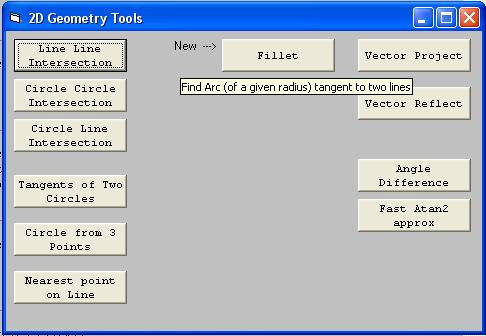



## Geometry Tools 2D

### Description

NEW:Draw arc of a given Radius tangent to two lines - Line Offset - Fast Atan2 Approx. - Circle Line Intersection - Line Line Intersection - Circle Circle Intersection - Circle from 3 Points - Tangents of 2 Circles - Vector Projection - Vector Reflection - Nearest point on Line - Angle Difference
 
### More Info
 

             |
---                |---
**Submitted On**   |2011-07-14 23:30:28
**By**             |[reexre](https://github.com/Planet-Source-Code/PSCIndex/blob/master/ByAuthor/reexre.md)
**Level**          |Intermediate
**User Rating**    |4.9 (79 globes from 16 users)
**Compatibility**  |VB 6\.0
**Category**       |[Math/ Dates](https://github.com/Planet-Source-Code/PSCIndex/blob/master/ByCategory/math-dates__1-37.md)
**World**          |[Visual Basic](https://github.com/Planet-Source-Code/PSCIndex/blob/master/ByWorld/visual-basic.md)
**Archive File**   |[Geometry\_T2208097142011\.zip](https://github.com/Planet-Source-Code/reexre-geometry-tools-2d__1-73873/archive/master.zip)

